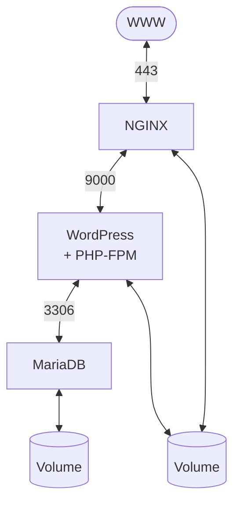

*This project has been created as part of the 42 curriculum.*

# inception

## Description

Containerized infrastructure built with **Docker** and **Docker Compose** with no pre-built images.

### Diagram of the infrastructure:



### Services

The infrastructure consists of the following **services**, each isolated in its own container:

- **NGINX**  
  Handles HTTPS traffic and acts as the entry point of the infrastructure.
  Configured to support **TLSv1.2** and **TLSv1.3**.

- **WordPress + PHP-FPM**  
  Runs the WordPress application and processes PHP requests.

- **MariaDB**  
  Provides the database used by WordPress.

### Volumes

Two persistent volumes are used to store data:

- **wordpress_db**  
  Stores the MariaDB database data.

- **wordpress_files**  
  Stores the WordPress website files.

## How to run

*Note: to run this project you need to have [Docker](https://www.docker.com/) installed. You can find the installation guide [here](https://docs.docker.com/desktop/?_gl=1*19toit*_gcl_au*MTYyMDUxNDMyNC4xNzcwMDIzNTk3*_ga*NTM5NTMzMTIwLjE3NzAwMjM1OTg.*_ga_XJWPQMJYHQ*czE3NzA4MDE0ODUkbzQkZzEkdDE3NzA4MDE0ODYkajU5JGwwJGgw).*

Clone this repository via the web URL or via SSH:

```bash
git clone https://github.com/s-gas/inception
```

Change to the project directory:

```bash
cd inception
```

All sensitive credentials are stored as Docker secrets in the `secrets/` directory at the root of the repository. These files are not committed to Git.
In order to run the containers, it is necessary to store the password for Wordpress and MariaDB in a file:

```bash
mkdir secrets && echo "<password>" > ./secrets/password.txt
```

You can replace `<password>` with a password of your choice.


Run docker compose via the Makefile:

```bash
make build
```

Since the infrastructure runs entirely locally, it is not accessible from the public internet. Access is limited to the host machine via the loopback IP address 127.0.0.1. To access the site, navigate to:

```bash
https://127.0.0.1
```

The TLS certificate is self-signed, so your browser will show a security warning. This is expected, you can safely proceed past it by clicking "Advanced" → "Proceed to 127.0.0.1 (unsafe)".

## Resources

### Documentation

- [Docker Documentation](https://docs.docker.com/)
- [Docker Compose Documentation](https://docs.docker.com/compose/)
- [DevOps with Docker, University of Helsinki](https://courses.mooc.fi/org/uh-cs/courses/devops-with-docker)
- [Nginx Documentation](https://nginx.org/en/docs/)
- [MariaDB Documentation](https://mariadb.org/documentation/)

### AI Usage

AI (Claude) was used mainly for clarifying the concepts read in the documentation.
