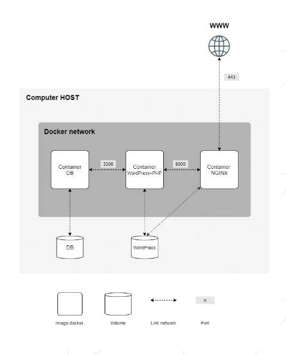

*This project has been created as part of the 42 curriculum.*

# Inception

## Description

Containerized infrastructure built with [Docker](https://www.docker.com/) and [Docker Compose](https://docs.docker.com/compose/).

### Diagram of the infrastructure:

### Services

The infrastructure consists of the following **services**, each isolated in its own container:

- **NGINX**  
  Handles HTTPS traffic and acts as the entry point of the infrastructure.
  Configured to support **TLSv1.2** and **TLSv1.3**.

- **WordPress + PHP-FPM**  
  Runs the WordPress application and processe
## Instructionss PHP requests.

- **MariaDB**  
  Provides the database used by WordPress.

### Volumes

Two persistent volumes are used to store data:

- **wordpress_db**  
  Stores the MariaDB database data.

- **wordpress_files**  
  Stores the WordPress website files.

## Instructions

[ TO BE COMPLETED ]

## Instructions
## Resources

### Documentation

- [Docker Documentation](https://docs.docker.com/)
- [Docker Compose Documentation](https://docs.docker.com/compose/)
- [DevOps with Docker, University of Helsinki](https://courses.mooc.fi/org/uh-cs/courses/devops-with-docker)
- [Nginx Documentation](https://nginx.org/en/docs/)

### AI Usage

AI (Claude) was used mainly for clarifying the concepts read in the documentation.